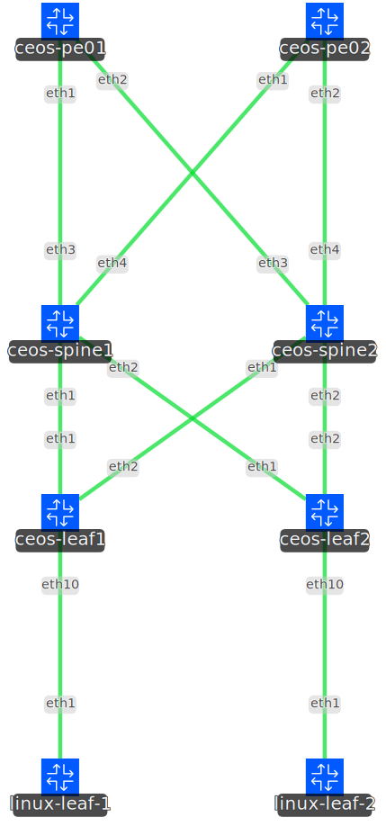
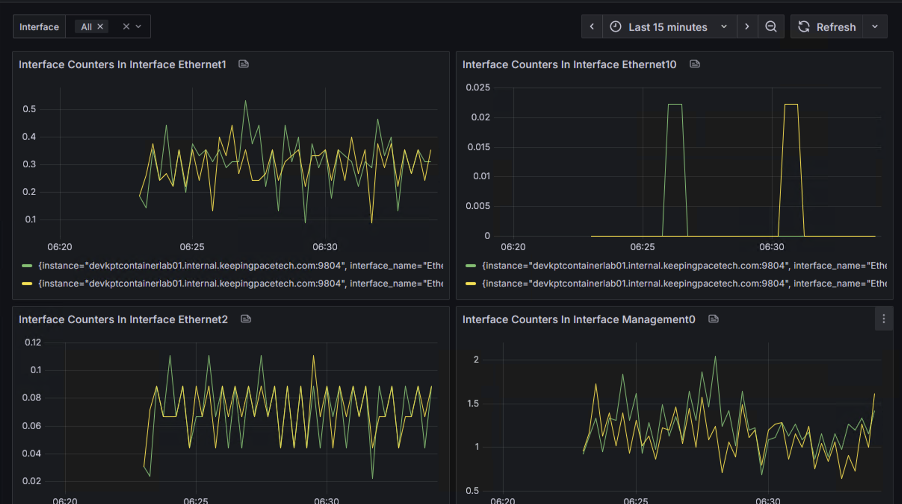

# ceos-telemetry-demo

This lab is currently a one rack/pod fabric with two clients connected between a mac-vrf. 

ceos-pe01/02 are the RRs for the iBGP routing domain, with eBGP underlay connecting the point-to-point links. 

gNMIc is used as a collection tool for gnmi requests towards the ceos devices, and currently subscribes for all interface statistics. 

gNMIc is utilizing a Prometheus output to allow the stats to be scraped and input into Grafana. Currently a simple dashboard is included to graph rate of packets input. 

### gNMIc

This can be installed as a service (example coming). To run quickly in a session, browse to the gnmic/ folder and run:
gnmic --config arista.yaml subscribe

Depending on the management addresses from containerlab when the lab is deployed, the IPs may need to be updated. 

If successful, you should be able to see metrics browsing to the http://[machine-ip]:9804/metrics

### Prometheus

In the prometheus/prometheus.yaml file, update the target to the IP address of the machine which gNMIc is running on. This is what scrapes the stats, and saves them for visualization in grafana. 

### Grafana

In grafana/dashboard.json contains an export of the .json of the example dashboard. When importing, the referenced datasource will likely need updated to point to your own Grafana configuration

